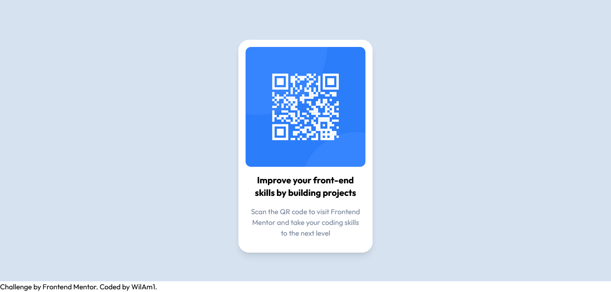

# Frontend Mentor - QR code component

My first Frontend Mentor Challenge. I tried to practice tailwindcss.

This is a solution to the [QR code component challenge on Frontend Mentor](https://www.frontendmentor.io/challenges/qr-code-component-iux_sIO_H). Frontend Mentor challenges help you improve your coding skills by building realistic projects.

### Screenshot

### Links

- Live Site URL: [Link](https://wilam1.github.io/001-qr-code-component-main/)

### Built with

- Semantic HTML5 markup
- TailwindCSS

### What I learned

I realized I really learn more by practicing and trying the techonology instead of watching tutorials and copying their code.

### Continued development

Continous Refinement

## Acknowledgments

TailwindCSS and Frontendmentor team
